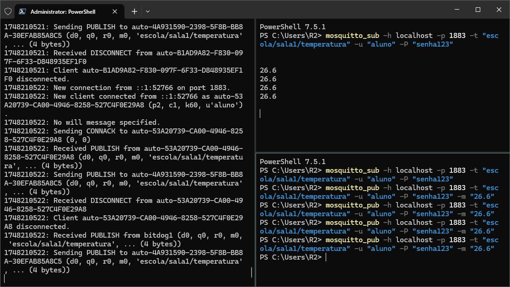
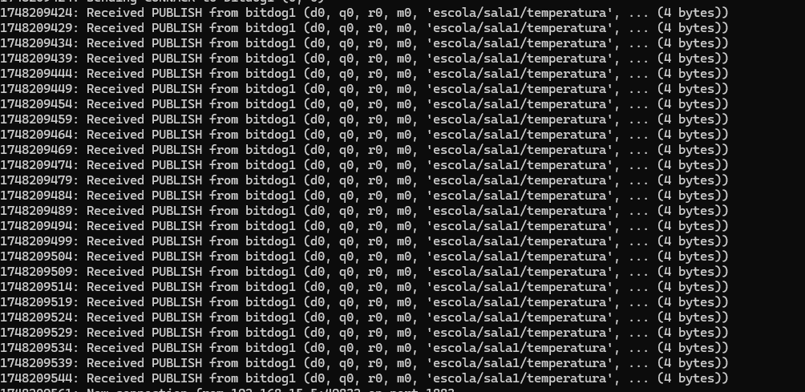
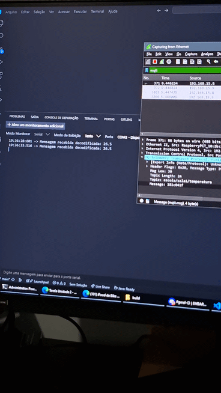
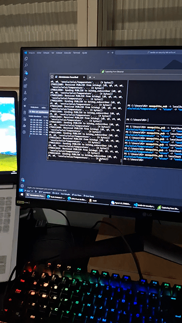
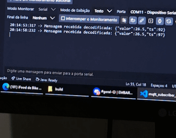

[](https://classroom.github.com/a/G8V_0Zaq)

# Tarefa: IoT Security Lab - EmbarcaTech 2025

Autor: **Arthur Damacena Silva**

Curso: Residência Tecnológica em Sistemas Embarcados

Instituição: EmbarcaTech - HBr

Brasília, maio de 2025

---

# Laboratório de Segurança em IoT: Comunicação MQTT com Criptografia

Este laboratório demonstra a implementação de um sistema IoT seguro utilizando o protocolo MQTT com criptografia XOR para transmissão de dados de temperatura simulados através do Raspberry Pi Pico W.

## 🔍 Visão Geral do Projeto

O sistema implementado consiste em:
- Um dispositivo Raspberry Pi Pico W atuando como publisher MQTT (BitDog1)
- Dados de temperatura simulados formatados em JSON
- Criptografia XOR aplicada às mensagens antes da transmissão
- Broker MQTT Mosquitto para intermediação das mensagens
- Subscriber (bitdog_subscriber) para receber e decifrar as mensagens

## 🛠️ Componentes do Sistema

- **Hardware**: Raspberry Pi Pico W
- **Protocolo de comunicação**: MQTT
- **Segurança**: Criptografia XOR
- **Software**:
  - Broker MQTT: Mosquitto
  - Ferramentas de CLI: mosquitto_pub e mosquitto_sub
  - Implementação em C para o Pico W

## 📋 Etapas de Execução

### 1️⃣ Configuração e Execução do Broker MQTT

Primeiro, inicializamos o broker MQTT Mosquitto com configurações específicas para o laboratório:

```bash
mosquitto -c mosquitto.conf -v
```


*Figura 1: Terminal mostrando comandos para teste do MQTT*

### 2️⃣ Publisher em Funcionamento

O dispositivo Pico W (BitDog1) executa o código que:
- Conecta-se à rede WiFi configurada
- Gera dados simulados de temperatura
- Criptografa os dados com a chave XOR
- Publica os dados no tópico MQTT "escola/sala1/temperatura"

```c
// Configura o cliente MQTT
mqtt_setup("bitdog1", "IP", "aluno", "senha123");
```


*Figura 2: Console mostrando o publisher em execução e enviando mensagens*

### 3️⃣ Subscribers Recebendo e Decifrando Mensagens

#### BitDog Subscriber

O primeiro subscriber recebe as mensagens criptografadas e aplica o algoritmo de decifração XOR para recuperar os dados originais:



*Figura 3: Subscriber recebendo as primeiras mensagens criptografadas*



*Figura 4: Mensagem encripitada e decripitada*



*Figura 5: Verificação da integridade dos dados decifrados*

## 🔐 Implementação da Criptografia

A segurança é implementada através de uma cifra XOR simples:

```c
// Criptografa a mensagem usando XOR com chave 42
xor_encrypt((uint8_t *)buffer, criptografada, strlen(buffer), 42);
```

Este método é adequado para fins educacionais, demonstrando os princípios básicos de criptografia em sistemas IoT. Para ambientes de produção, algoritmos mais robustos como AES seriam recomendados.

## 🧪 Análise de Segurança

- **Vantagens da implementação**:
  - Dados protegidos durante a transmissão
  - Baixo overhead computacional, ideal para dispositivos com recursos limitados
  - Facilidade de implementação para fins educacionais

- **Limitações**:
  - A cifra XOR é vulnerável a ataques de texto claro conhecido
  - Uso de credenciais fixas no código
  - Ausência de TLS para a conexão MQTT

## 🎓 Conclusões e Aprendizados

Este laboratório demonstra os princípios básicos de segurança em IoT, incluindo:
- Implementação de comunicação usando MQTT
- Aplicação de criptografia em dispositivos com recursos limitados
- Gerenciamento de chaves (mesmo que simplificado)
- Importância da proteção de dados em trânsito

Para sistemas reais, recomenda-se complementar esta abordagem com:
- Algoritmos de criptografia mais robustos
- Implementação de TLS para MQTT
- Rotação de chaves criptográficas
- Autenticação mais segura

---

## 📜 Licença
GNU GPL-3.0.
